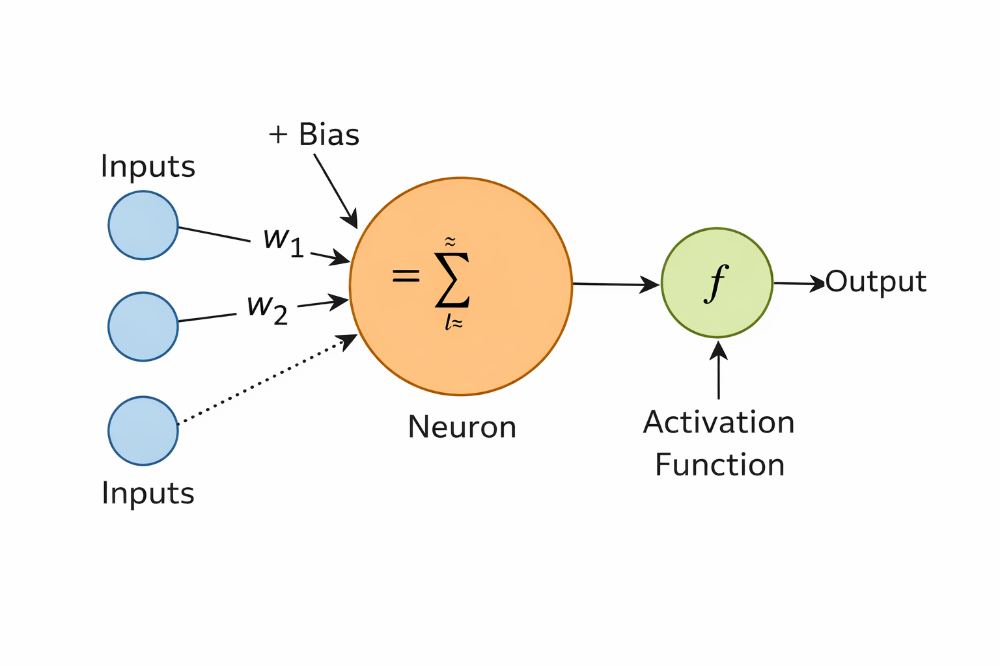

# What Is an Artificial Neuron?

In this document, we will examine the concept of the **artificial neuron**, which is the most fundamental building block of artificial intelligence.

## Purpose

- not to scare with mathematics
- not to present complex formulas
- to understand what a neuron actually does

## Where Does the Neuron Idea Come From?

The idea of the artificial neuron is inspired by biological neurons in the human brain.

A biological neuron:

- receives many inputs
- processes these inputs
- produces an output or not

The artificial neuron applies the same idea in a much simpler way.

## Basic Components of an Artificial Neuron

Inside an artificial neuron, there are only a few things:

- inputs
- weights
- bias
- activation function
- output

That is all.

🔥 No consciousness\
🧠 No intuition\
✨ And no magic

## Inputs

Inputs are numbers coming from the outside world.

Example inputs for the ping-pong game:

- the x coordinate of the ball
- the y coordinate of the ball
- the ball's velocity in the x direction
- the ball's velocity in the y direction
- the y position of the paddle

A neuron does not know what these values mean. It only knows that they are numbers.

> **Note:** Values such as the angle of impact are not given directly as inputs. Such information can be derived from position and velocity data and can be optionally added in later stages.

## Weights

Each input has a weight.

A weight expresses the following:
> How important is this input?

Example:

- the y position of the ball may be important
- the x velocity of the ball may be less important

Weights are learned values.
They can be random at the beginning.
They change during the learning process.

## What Is Bias?

Bias is the neuron's constant offset value.

It answers the question:
> How sensitive should the neuron be?

Thanks to bias:

- even if all inputs are zero
- the neuron can still produce an output

In practice, bias is used to adjust the decision threshold.

## Summation and the Moment of Decision

An artificial neuron performs the following operation:

- multiplies each input by its own weight
- sums them all
- adds the bias

A single number emerges.

At this point, no decision has been made yet.
There is only a score.

## Activation Function

The activation function decides:
> Is this score sufficient to produce an output?

Common examples:

- sigmoid
- tanh
- ReLU

The purpose in this project is:

- not to memorize complex functions
- but to understand why such a step is needed

Without an activation function:

- the neuron becomes just a linear calculator

## Output

The output is the decision made by the neuron.

Example for ping-pong:

- move up
- move down
- stay still

A single neuron usually makes simple decisions.
That is why neurons are used together, not alone.

## Limits of a Single Neuron

A single neuron:

- can learn simple relationships
- cannot learn complex behaviors

Therefore:

- neurons are combined in layers
- the concept of a neural network emerges

> Neural networks are not initialized with identical starting values.\
Because all neurons behaving the same way prevents the network from learning different paths.

## Connection with the Ping-Pong Project

In this project:

- the neuron is a decision unit
- weights represent learned behavior
- bias affects how aggressive the paddle will be

When the AI learns to play well:

- in fact, the weights have approached the correct values

## Summary

- An artificial neuron is a simple mathematical model
- It contains input, weight, bias, and activation
- Learning is the change of weights over time
- Complex behaviors are possible with many neurons

In the next document, we will examine how these neurons come together and how the [**neural network**](./03-NeuralNetwork.md) structure is formed.

## See Also

- [Home Page](./README.md)
- [What AI is and is not, its relation to code](./00-WhatIsAI.md)
- [The concept of learning, supervised / unsupervised / reinforcement](./01-WhatIsLearning.md)
- *Artificial neuron, input/weight/bias, simple example*
- &gt; [Mini neural network, hidden layer, feedforward network](./03-NeuralNetwork.md)
- [Reward and punishment, self-play, basic RL logic](./04-ReinforcementLearning.md)
- [Hassabis approach, self-play, modular architecture](./05-WhyThisArchitecture.md)
- [PingPongAI.App Rationale](./06-PingPongAI.App.md)
- [PingPongAI.App Game Rules](./07-PingPongAI.App.Rules.md)
