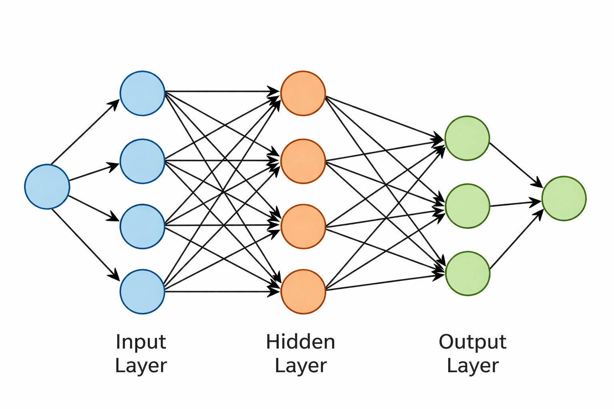

# Neural Network (Artificial Neural Network)

This document explains the transition from a single artificial neuron to a multi-neuron structure.

## Purpose

- not to teach mathematics
- to intuitively establish the idea of a neural network
- to show why learning is not possible with a single neuron

## The Limitation of a Single Neuron

As we saw in the [previous document](./02-Neuron.md):

- a single neuron
- receives inputs
- multiplies them by weights
- produces an output

This structure:

- is sufficient for simple decisions
- can distinguish linear relationships

However, real-world problems:

- are multi-dimensional
- are not linear
- require multiple features to be evaluated together

At this point, the **idea of a network** emerges.

## What Is a Neural Network?

A neural network:

- consists of multiple artificial neurons
- these neurons are organized in layers
- each layer takes the output of the previous layer as its input

The important point is this:

> Intelligence is not in a single neuron, but in neurons working together.

## The Concept of Layers

A neural network usually consists of three basic layers.

### 1. Input Layer

The input layer:

- receives raw data from the outside world
- does not perform calculations
- does not make decisions
- only carries data into the network

Example inputs for the ping-pong game:

- the x coordinate of the ball
- the y coordinate of the ball
- the ball's velocity in the x direction
- the ball's velocity in the y direction
- the y position of the paddle

### 2. Hidden Layers

This is where the actual learning happens.

Hidden layers:

- cannot be directly observed from the outside
- cannot be interpreted by humans
- produce abstract representations

Here:

- ⚡ intuitive behaviors may appear
- 🔥 but no consciousness emerges

These layers:

- capture patterns
- discover relationships
- shape decision boundaries

### 3. Output Layer

The output layer:

- represents the final decision made by the network
- produces numerical values
- these values are converted into actions

Example outputs for ping-pong:

- move up
- move down
- stay still

For a neural network, none of these have inherent meaning.\
They are just numbers.

## How Does Information Flow Through the Network?

The flow of information:

- starts at the input layer
- passes through the hidden layers
- ends at the output layer

This process is called **feed-forward**.

At each step:

- weights play a role
- activation functions come into play
- values are transformed

The network:

- does not know rules
- does not know goals
- only performs mathematical transformations

## Why Is Depth Important?

As the number of layers increases:

- representational power increases
- more complex patterns can be captured
- the level of abstraction rises

However:

- not every problem requires a deep network
- for simple problems, simple networks are more effective

Depth:

- is a strength
- but it also comes with a cost

## What Is a Neural Network Not?

This section should be especially clear.

A neural network:

- does not think
- does not understand
- 🔥 is not conscious
- has no intent
- ✨ is not magic

The only thing it does is this:

- takes numbers
- applies numerical transformations
- produces numbers

## PingPongAI Context

In this project, the neural network:

- does not know the game
- does not know the rules
- does not know how to win

It only:

- observes states
- produces outputs
- changes based on outcomes

Learning:

- happens in the next stage
- through reward and punishment

A neural network cannot learn on its own.

For learning, the following are required:

- feedback
- reward
- punishment

In the next document, we will examine how the [**reward and punishment**](./04-ReinforcementLearning.md) structure is formed for neural network learning.

## See Also

- [Home Page](./README.md)
- [What AI is and is not, its relation to code](./00-WhatIsAI.md)
- [The concept of learning, supervised / unsupervised / reinforcement](./01-WhatIsLearning.md)
- [Artificial neuron, input/weight/bias, simple example](./02-Neuron.md)
- *Mini neural network, hidden layer, feedforward network*
- &gt; [Reward and punishment, self-play, basic RL logic](./04-ReinforcementLearning.md)
- [Hassabis approach, self-play, modular architecture](./05-WhyThisArchitecture.md)
- [PingPongAI.App Rationale](./06-PingPongAI.App.md)
- [PingPongAI.App Game Rules](./07-PingPongAI.App.Rules.md)
- [Rule-Based Agent Approach](./08-RuleBased.md)
