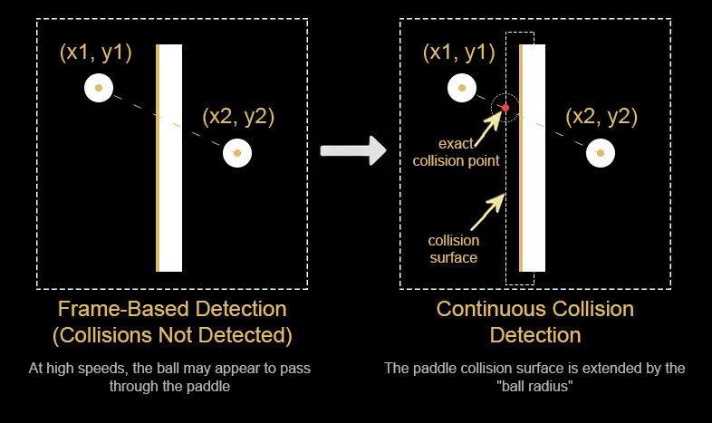

# PingPongAI.App Rationale

This document was prepared to explain the architectural and technical reasons behind the desktop Ping-Pong application developed as part of the PingPongAI project. The application is not just a game. It is also an observable and controllable simulation environment in which a simple neural structure library developed from scratch will be trained.

## Why this application?

The Ping-Pong game was deliberately chosen for artificial intelligence training.

The main reasons for this choice are listed below.

- The game rules are extremely simple
- The physics rules are limited and deterministic
- The input and output space is small
- It requires real-time decision making
- Success and failure can be measured clearly
- Behavioral analysis can be performed visually

Thanks to these characteristics, Ping-Pong provides an ideal starting environment for observing AI behavior before moving on to complex simulations.

The goal is not to write a "high-score producing bot", but to make every step of the learning process understandable.

## Why was WPF chosen?

The application was developed as a desktop Windows application, and WPF was chosen for the UI layer.

> - **Microsoft Visual Studio Community 2022 (64-bit) - Version 17.14.23** was used as the code editor.
> - **Visual Studio Code - Version 1.107.1** was used for editing Markdown documents.

The reasons for this choice are as follows.

- Natural integration with the .NET ecosystem
- Strong type safety with C#
- Clear separation of UI and game logic
- Controlled render loop via DispatcherTimer and CompositionTarget
- A structure compatible with the [MVVM (Model-View-ViewModel)](https://learn.microsoft.com/en-US/dotnet/architecture/maui/mvvm) approach
- Easy debugging and visual inspection capabilities

WPF is not a high-performance game engine. However, the goal of this project is not maximum FPS, but a controlled and predictable game loop.

This provides an advantage from an AI training perspective.

## Reason for developing the game environment independently from the AI

The game environment was initially designed completely independently of the artificial intelligence.

This is a deliberate architectural decision.

The main reasons are explained below.

- The game should be playable by two humans
- The AI should be positioned not as a "player" but as an externally connected decision maker, although it can also take on a "player role"
- The game engine must remain deterministic
- The game must be fully functional even without AI
- AI behavior must be isolatable during training

Thanks to this structure, the AI behaves like an input source that controls the paddle.

From the game engine's perspective, there is no difference between a human player and an AI player. Both use the same paddle movement interface.

This approach also makes it possible to compare different AI algorithms within the same game environment in the future.

## Screen refresh rate and timing model of the game

The game has an update loop that operates with fixed time steps.

This loop generally follows the principles below.

- Fixed delta time is used
- Logic updates are independent of render frequency
- Ball and paddle movements are time-based, not frame-based

The reason for this approach is to prevent different FPS values on different machines from changing game behavior.

From an AI training perspective, producing the same results under the same input conditions is critically important.

## What is the tunnelling effect?

The tunnelling effect occurs when a moving object jumps from one position to another within a single frame and skips the collision in between.

In the Ping-Pong game, this effect appears as follows.

- The ball speed is high
- The paddle thickness is limited
- In one frame the ball may be on one side of the paddle, and in the next frame it may have passed to the other side
- In this case, the collision is not detected at all

This causes the ball to appear as if it passes through the paddle. This is called the **tunnelling effect**.

## How was the tunnelling effect overcome?

To solve this problem, classical bounding box collision detection is not sufficient.

The following approach was adopted in the application.

- The previous position of the ball is stored
- A movement vector is created between the current position and the previous position of the ball
- The paddle surface is treated as a line or as a rectangle expanded by the radius of the ball
- It is tested whether the movement vector intersects with the paddle surface
- If an intersection exists, the collision point is calculated
- The direction vector of the ball is reflected at this point
- The ball radius and the contact points with the paddle must be taken into account

Thanks to this approach:

- Collisions are not missed even at high speeds
- Game physics do not break even if FPS drops
- Physical consistency is preserved during AI training

This solution provides a simple but reliable collision model without using a real-time physics engine.

## Conclusion

`PingPongAI.App` is not a game that was deliberately kept simple.

On the contrary, it is a simulation environment designed with the goals of deterministic behavior, observability, and controllability required for AI training.

This application serves as a foundational building block for clearly observing the following aspects of future neural structures:

- The learning process
- Error behaviors
- Decision delays
- Generalization capabilities

## See Also

- [Home](.//README.md)
- [What AI is and is not, its relation to code](./00-WhatIsAI.md)
- [The concept of learning, supervised / unsupervised / reinforcement](./01-WhatIsLearning.md)
- [Artificial neuron, input/weight/bias, simple example](./02-Neuron.md)
- [Mini neural network, hidden layer, feedforward network](./03-NeuralNetwork.md)
- [Reward and punishment, self-play, basic RL logic](./04-ReinforcementLearning.md)
- [Hassabis approach, self-play, modular architecture](./05-WhyThisArchitecture.md)
- *PingPongAI.App Rationale*
- &gt; [PingPongAI.App Game Rules](./07-PingPongAI.App.Rules.md)
