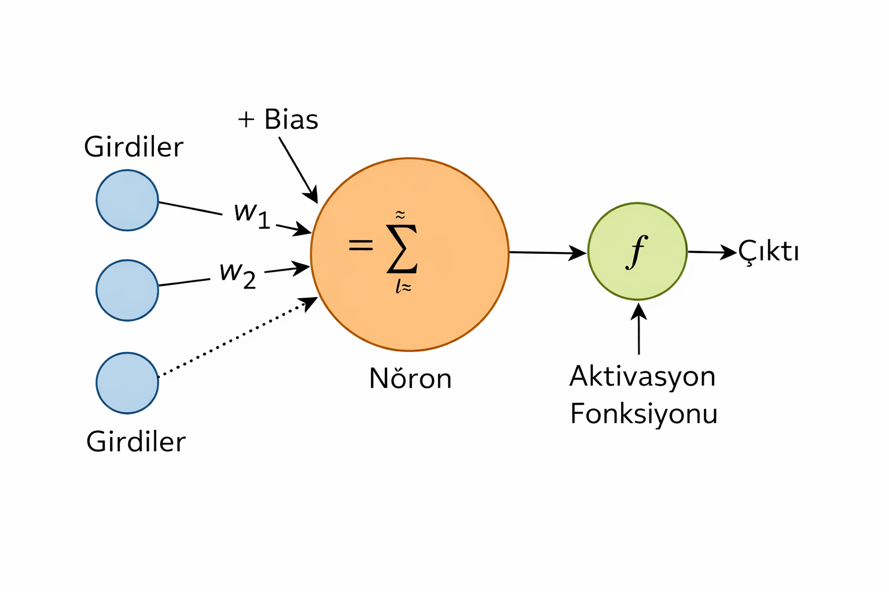

# Yapay Nöron Nedir?

Bu dokümanda yapay zekanın en temel yapı taşı olan **yapay nöron** kavramını ele alacağız.

## Amaç

- matematik korkutmak değil
- karmaşık formüller göstermek değil
- bir nöronun gerçekten ne yaptığını anlamak

## Nöron Fikri Nereden Geliyor?

Yapay nöron fikri, insan beynindeki biyolojik nöronlardan esinlenmiştir.

Biyolojik bir nöron:

- birçok girdiyi alır
- bu girdileri işler
- bir çıktı üretir ya da üretmez

Yapay nöron da aynı fikri çok daha basit şekilde uygular.

## Yapay Nöronun Temel Bileşenleri

Bir yapay nöronun içinde sadece birkaç şey vardır:

- girdiler (inputs)
- ağırlıklar (weights)
- bias
- aktivasyon fonksiyonu
- çıktı (output)

Hepsi bu.

🔥 Ne bilinç var\
🧠 Ne sezgi\
✨ Ne de sihir

## Girdiler (Inputs)

Girdiler, dış dünyadan gelen sayılardır.

Ping-pong oyunu için örnek girdiler:

- topun x koordinatı
- topun y koordinatı
- topun x yönündeki hızı
- topun y yönündeki hızı
- raketin y konumu

Bir nöron bu değerlerin ne anlama geldiğini bilmez. Sadece sayı olduklarını bilir.

> **Not:** Çarpma açısı gibi değerler doğrudan girdi olarak verilmemiştir. Bu tür bilgiler, konum ve hız verilerinden türetilebilir ve ilerleyen aşamalarda isteğe bağlı olarak eklenebilir.

## Ağırlıklar (Weights)

Her girdinin bir ağırlığı vardır.

Ağırlık şunu ifade eder:
> Bu girdi ne kadar önemli?

Örnek:

- topun y konumu önemli olabilir
- topun x hızı daha az önemli olabilir

Ağırlıklar öğrenilen değerlerdir.
Başlangıçta rastgele olabilirler.
Öğrenme sürecinde değişirler.

## Bias Nedir?

Bias, nöronun sabit kaydırma değeridir.

Şu soruya cevap verir:
> Nöron ne kadar hassas olsun?

Bias sayesinde:

- tüm girdiler sıfır olsa bile
- nöron çıktı üretebilir

Pratikte bias, karar eşiğini ayarlamak için kullanılır.

## Toplama ve Karar Anı

Yapay nöron şu işlemi yapar:

- her girdiyi kendi ağırlığı ile çarpar
- hepsini toplar
- bias ekler

Ortaya tek bir sayı çıkar.

Bu noktada henüz karar verilmemiştir.
Sadece bir skor vardır.

## Aktivasyon Fonksiyonu

Aktivasyon fonksiyonu şuna karar verir:
> Bu skor çıktı üretmeye yeterli mi?

Yaygın örnekler:

- sigmoid
- tanh
- ReLU

Bu projede amaç:

- karmaşık fonksiyonları ezberlemek değil
- neden böyle bir adıma ihtiyaç olduğunu görmek

Aktivasyon fonksiyonu olmazsa:

- nöron sadece doğrusal bir hesap makinesi olur

## Çıktı (Output)

Çıktı, nöronun verdiği karardır.

Ping-pong için örnek:

- yukarı git
- aşağı git
- yerinde kal

Tek bir nöron genelde basit kararlar verir.
Bu yüzden nöronlar tek başına değil, birlikte kullanılır.

## Tek Nöronun Sınırları

Tek bir nöron:

- basit ilişkileri öğrenebilir
- karmaşık davranışları öğrenemez

Bu yüzden:

- nöronlar katmanlar halinde birleştirilir
- neural network kavramı ortaya çıkar

> Sinir ağları aynı başlangıç değerleriyle başlatılmaz.\
Çünkü tüm nöronların aynı davranması, ağın farklı yollar öğrenmesini engeller.

## Ping-Pong Projesi ile Bağlantı

Bu projede:

- nöron bir karar birimidir
- ağırlıklar öğrenilen davranışı temsil eder
- bias, raketin ne kadar agresif olacağını etkiler

AI iyi oynamayı öğrendiğinde:

- aslında ağırlıklar doğru değerlere yaklaşmıştır

## Özet

- Yapay nöron basit bir matematiksel modeldir
- Girdi, ağırlık, bias ve aktivasyon içerir
- Öğrenme, ağırlıkların zamanla değişmesidir
- Karmaşık davranışlar, çok sayıda nöronla mümkündür

Bir sonraki dokümanda, bu nöronların nasıl bir araya geldiğini ve [**neural network**](./03-NeuralNetwork.md) yapısının nasıl oluştuğunu ele alacağız.

## Ayrıca Bakınız

- [Ana Sayfa](../../README.md)
- [AI nedir, ne değildir, kodla ilişkisi](00-WhatIsAI.md)
- [Öğrenme kavramı, supervised / unsupervised / reinforcement](./01-WhatIsLearning.md)
- *Yapay nöron, girdi/ağırlık/bias, basit örnek*
- &gt; [Mini neural network, hidden layer, ileri beslemeli ağ](./03-NeuralNetwork.md)
- [Ödül ve ceza, self-play, temel RL mantığı](./04-ReinforcementLearning.md)
- [Hassabis yaklaşımı, self-play, modüler mimari](./05-WhyThisArchitecture.md)
- [PingPongAI.App Gerekçeleri](./06-PingPongAI.App.md)
- [PingPongAI.App Oyun Kuralları](./07-PingPongAI.App.Rules.md)
- [Kural Tabanlı Ajan Yaklaşımı](./08-RuleBased.md)
- [AIAgent - Supervised Control Yaklaşımı](./09-AIAgent-SupervisedControl.md)
