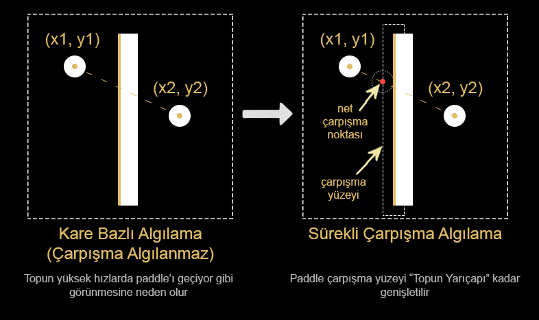

# PingPongAI.App Gerekçeleri

Bu doküman, PingPongAI projesi kapsamında geliştirilen masaüstü Ping-Pong uygulamasının mimari ve teknik gerekçelerini açıklamak amacıyla hazırlanmıştır. Uygulama yalnızca bir oyun değildir. Aynı zamanda sıfırdan geliştirilen basit bir nöral yapı kütüphanesinin eğitileceği, gözlemlenebilir ve kontrol edilebilir bir simülasyon ortamıdır.

## Neden bu uygulama?

Ping-Pong oyunu, yapay zeka eğitimi için özellikle tercih edilmiştir.

Bu tercihin temel nedenleri aşağıda listelenmiştir.

- Oyun kuralları son derece basittir
- Fizik kuralları sınırlı ve deterministtir
- Girdi ve çıktı uzayı küçüktür
- Gerçek zamanlı karar verme gerektirir
- Başarı ve başarısızlık net biçimde ölçülebilir
- Görsel olarak davranış analizi yapılabilir

Bu özellikler sayesinde Ping-Pong, karmaşık simülasyonlara geçmeden önce AI davranışlarını gözlemlemek için ideal bir başlangıç ortamı sunar.

Amaç, "yüksek skor üreten bir bot" yazmak değil, öğrenme sürecinin her adımının anlaşılabilir olmasıdır.

## Neden WPF tercih edildi?

Uygulama masaüstü bir Windows uygulaması olarak geliştirilmiştir ve UI katmanı için WPF tercih edilmiştir.

> - Kod editörü olarak **Microsoft Visual Studio Community 2022 (64-bit) - Version 17.14.23** kullanılmıştır.
> - Markdown dokümanları için **Visual Studio Code - Versiyon 1.107.1** editörü kullanılmıştır.

Bu tercihin nedenleri şunlardır.

- .NET ekosistemi ile doğal uyum
- C# ile güçlü tip güvenliği
- UI ve oyun mantığının net biçimde ayrılabilmesi
- DispatcherTimer ve CompositionTarget üzerinden kontrollü render döngüsü
- [MVVM (Model-View-ViewModel)](https://learn.microsoft.com/tr-tr/dotnet/architecture/maui/mvvm) yaklaşımına uygun yapı
- Kolay hata ayıklama ve görsel inceleme imkanı

WPF, yüksek performanslı bir oyun motoru değildir. Ancak bu proje için hedeflenen şey maksimum FPS değil, kontrollü ve öngörülebilir bir oyun döngüsüdür.

Bu da AI eğitimi açısından avantaj sağlar.

## Oyun ortamının AI'dan bağımsız geliştirilmesinin nedeni

Oyun ortamı başlangıçta, yapay zekadan tamamen bağımsız olarak tasarlanmıştır.

Bu bilinçli bir mimari karardır.

Temel gerekçeler aşağıda açıklanmıştır.

- Oyun, iki insan tarafından oynanabilir olmalıdır
- AI bir "oyuncu" değil, dışarıdan bağlanan bir karar verici olarak konumlanmalıdır ancak bir "oyuncu rolü" de alabilir
- Oyun motoru deterministik kalmalıdır
- AI olmadan da oyun tüm işlevlerini yerine getirebilmelidir
- Eğitim sırasında AI davranışı izole edilebilmelidir

Bu yapı sayesinde AI, paddle kontrolünü sağlayan bir input kaynağı gibi davranır.

İnsan oyuncu ile AI oyuncu arasında, oyun motoru açısından hiçbir fark yoktur. Her ikisi de aynı paddle hareket arayüzünü kullanır.

Bu yaklaşım, ileride farklı AI algoritmalarının aynı oyun ortamında karşılaştırılmasını da mümkün kılar.

## Oyun ekranının tarama frekansı ve zamanlama modeli

Oyun, sabit zaman adımlarıyla çalışan bir güncelleme döngüsüne sahiptir.

Bu döngü genellikle aşağıdaki prensiplerle çalışır.

- Sabit delta time kullanılır
- Mantık güncellemeleri render frekansından bağımsızdır
- Top ve paddle hareketleri zaman bazlıdır, frame bazlı değildir

Bu yaklaşımın nedeni, farklı makinelerde farklı FPS değerlerinin oyun davranışını değiştirmesini engellemektir.

AI eğitimi açısından, aynı giriş koşullarında aynı sonuçların üretilmesi kritik öneme sahiptir.

## Tunnelling etkisi nedir?

Tunnelling etkisi, hareket eden bir nesnenin bir frame'de bir konumdan diğerine sıçrayarak, aradaki çarpışmayı atlaması durumudur.

Ping-Pong oyununda bu etki şu şekilde ortaya çıkar.

- Topun hızı yüksektir
- Paddle'ın kalınlığı sınırlıdır
- Bir frame'de top paddle'ın bir tarafındayken, bir sonraki frame'de diğer tarafına geçmiş olabilir
- Bu durumda çarpışma hiç algılanmaz

Bu durum, topun paddle'ın içinden geçiyormuş gibi görünmesine neden olur. Buna da **tünel etkisi** denir.

## Tunnelling etkisi nasıl aşıldı?

Bu problemi çözmek için klasik bounding box çarpışma kontrolü yeterli değildir.

Uygulamada aşağıdaki yaklaşım benimsenmiştir.

- Topun önceki konumu saklanır
- Topun mevcut konumu ile önceki konumu arasında bir hareket vektörü oluşturulur
- Paddle yüzeyi bir çizgi veya topun yarıçapı kadar genişletilerek bir diktörgen olarak ele alınır
- Hareket vektörü ile paddle yüzeyinin kesişip kesişmediği test edilir
- Kesişim varsa, çarpışma noktası hesaplanır
- Topun yön vektörü bu noktada yansıtılır
- Topun yarıçapı ve paddle ile temas noktaları dikkate alınmalıdır

Bu yaklaşım sayesinde:

- Yüksek hızlarda bile çarpışmalar kaçırılmaz
- FPS düşse bile oyun fiziği bozulmaz
- AI eğitimi sırasında fizik tutarlılığı korunur

Bu çözüm, gerçek zamanlı fizik motoru kullanmadan, basit ama güvenilir bir çarpışma modeli sunar.

## Sonuç

`PingPongAI.App`, bilinçli olarak basit tutulmuş bir oyun değildir.

Aksine, AI eğitimi için gerekli olan deterministik davranış, izlenebilirlik ve kontrol edilebilirlik hedeflenerek tasarlanmış bir simülasyon ortamıdır.

Bu uygulama, ileride geliştirilecek nöral yapıların:

- Öğrenme sürecini
- Hata davranışlarını
- Karar gecikmelerini
- Genelleme yeteneklerini

net biçimde gözlemleyebilmek için temel bir yapı taşıdır.

Bir sonraki bölümde [Ping-pong oyun kuralları](./07-PingPongAI.App.Rules.md) anlatılacaktır.

## Ayrıca Bakınız

- [Ana Sayfa](../../README.md)
- [AI nedir, ne değildir, kodla ilişkisi](00-WhatIsAI.md)
- [Öğrenme kavramı, supervised / unsupervised / reinforcement](./01-WhatIsLearning.md)
- [Yapay nöron, girdi/ağırlık/bias, basit örnek](./02-Neuron.md)
- [Mini neural network, hidden layer, ileri beslemeli ağ](./03-NeuralNetwork.md)
- [Ödül ve ceza, self-play, temel RL mantığı](./04-ReinforcementLearning.md)
- [Hassabis yaklaşımı, self-play, modüler mimari](./05-WhyThisArchitecture.md)
- *PingPongAI.App Gerekçeleri*
- &gt; [PingPongAI.App Oyun Kuralları](./07-PingPongAI.App.Rules.md)
