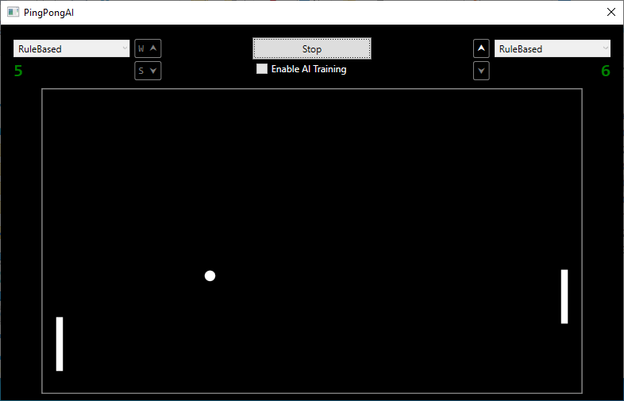

# Rule-Based Agent Yaklaşımı

Bu doküman, `PingPongAI` projesi kapsamında geliştirilen **`RuleBasedAgent`** yapısının amacını, kapsamını ve mimari konumunu açıklamak için hazırlanmıştır.

Rule-based yaklaşım, öğrenen bir AI sistemi devreye alınmadan önce oyunun oynanabilirliğini, deterministik davranışını ve ajan soyutlamasının doğruluğunu test etmek için bilinçli olarak tercih edilmiştir.

## Kural Tabanlı Ajan Nedir?

`RuleBasedAgent`, çevreden aldığı gözlemlere göre **önceden tanımlanmış kurallar** ile karar veren bir oyuncu ajanıdır.

Bu ajan:

- Öğrenme yapmaz
- Model eğitimi içermez
- Rastgelelik barındırmaz (kontrollü durumlar hariç)
- Aynı giriş koşullarında aynı çıktıları üretir

Bu özellikleri sayesinde, oyun motoru ve ajan arayüzlerinin doğrulanması için ideal bir referans ajan görevi görür.

## Neden Kural Tabanlı Ajan ile Başlandı?

AI veya reinforcement learning tabanlı bir ajan geliştirmeden önce aşağıdaki soruların net biçimde cevaplanması gerekir:

- Oyun ortamı deterministik mi?
- Ajan, oyun motorundan bağımsız mı?
- Oyuncu davranışı soyutlanabiliyor mu?
- İnsan oyuncu ile AI oyuncu aynı arayüzü mü kullanıyor?

`RuleBasedAgent`, bu sorulara yanıt verebilmek için geliştirilmiştir.

Bu yaklaşım sayesinde:

- Oyun motoru ile ajan katmanı birbirinden ayrıştırılmıştır
- İnsan ve AI oyuncular arasında mimari fark kalmamıştır
- Öğrenme içermeyen ama karar verebilen bir ajan referansı oluşturulmuştur

## PingPongAI.AI Kütüphanesi

AI ile ilgili tüm ajanlar, **`PingPongAI.AI`** isimli ayrı bir kütüphane altında geliştirilmiştir.

Bu kütüphane:

- `netstandard2.0` hedefi ile oluşturulmuştur
- UI veya WPF bağımlılığı içermez
- Oyun motoru ile yalnızca tanımlı arayüzler üzerinden haberleşir

Bu yapı, ileride farklı UI teknolojileri veya simülasyon ortamları ile aynı AI kütüphanesinin kullanılabilmesini mümkün kılar.

## Mevcut Ajan Tipleri

Şu anda aşağıdaki ajan sınıfları tanımlanmıştır:

- **HumanAgent**
  - Klavye veya kullanıcı girdisi ile kontrol edilir
  - Doğrudan insan oyuncu davranışını temsil eder

- **RuleBasedAgent**
  - Topun konumuna ve hızına göre paddle hareketi üretir
  - Önceden tanımlanmış karar kuralları kullanır
  - Öğrenme veya adaptasyon içermez

- **AIAgent**
  - Öğrenen ajanlar için ayrılmıştır
  - Bu sürümde yalnızca iskelet yapı mevcuttur
  - İçeriği bilinçli olarak boş bırakılmıştır

## Uygulama Tarafındaki Entegrasyon

PingPongAI.App WPF uygulamasında:

- Oyuncu rollerinin seçilebilmesi için seçim nesneleri eklenmiştir
- Oyun başlat - durdur kontrolü sağlanmıştır
- Her iki paddle için farklı ajan tipleri atanabilir hale getirilmiştir

Bu sayede aşağıdaki senaryolar desteklenmektedir:

- İnsan - İnsan
- İnsan - Kural Tabanlı Ajan
- Kural Tabanlı Ajan - Kural Tabanlı Ajan

`HumanAgent` <--> `RuleBasedAgent` karşılaşması test edilmiş ve sorunsuz şekilde çalıştığı doğrulanmıştır.

## Kural Tabanlı Ajanların Sınırları

`RuleBasedAgent`, bilinçli olarak sınırlı tutulmuştur.

Bu ajan:

- Öğrenme yapmaz
- Hata geçmişini tutmaz
- Ödül - ceza mekanizması içermez
- Uzun vadeli strateji geliştirmez

Bu sınırlamalar, ileride geliştirilecek öğrenen ajanların davranışlarını net biçimde karşılaştırabilmek için gereklidir.

## Sonuç

`Rule-based` yaklaşım, `PingPongAI` projesinde bir ara adım değil, **bilinçli bir mimari doğrulama katmanı**dır.

Bu yapı sayesinde:

- Oyun motoru güvenilir hale getirilmiş
- Ajan soyutlaması doğrulanmış
- AI entegrasyonu için sağlam bir zemin oluşturulmuştur

Dokümanın bu noktasına kadar yapılan değişiklikler ve güncellemelere ait kodlara [v1.1-rule-based](https://github.com/GERD0GDU/PingPongAI/tree/v1.1-rule-based) etiketinden erişebilirsiniz.

Bir sonraki adımda, `AIAgent` sınıfının doldurulması ve öğrenen davranışların kontrollü şekilde sisteme dahil edilmesi hedeflenmektedir.

## Ayrıca Bakınız

- [Ana Sayfa](../../README.md)
- [AI nedir, ne değildir, kodla ilişkisi](00-WhatIsAI.md)
- [Öğrenme kavramı, supervised / unsupervised / reinforcement](./01-WhatIsLearning.md)
- [Yapay nöron, girdi/ağırlık/bias, basit örnek](./02-Neuron.md)
- [Mini neural network, hidden layer, ileri beslemeli ağ](./03-NeuralNetwork.md)
- [Ödül ve ceza, self-play, temel RL mantığı](./04-ReinforcementLearning.md)
- [Hassabis yaklaşımı, self-play, modüler mimari](./05-WhyThisArchitecture.md)
- [PingPongAI.App Gerekçeleri](./06-PingPongAI.App.md)
- [PingPongAI.App Oyun Kuralları](./07-PingPongAI.App.Rules.md)
- *Kural Tabanlı Ajan Yaklaşımı*
- &gt; [AIAgent - Supervised Control Yaklaşımı](./09-AIAgent-SupervisedControl.md)
